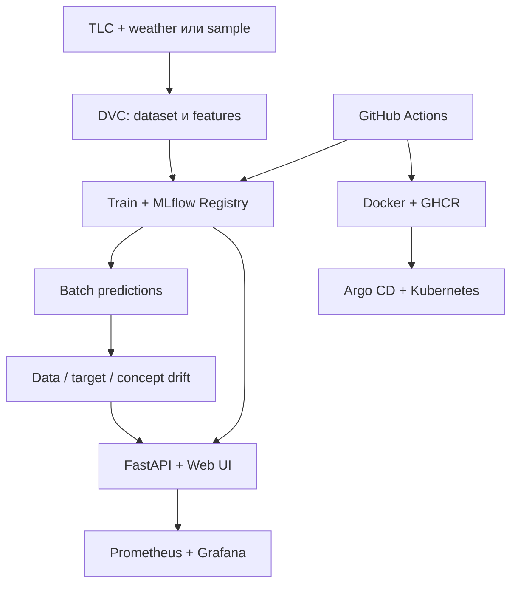

# NYC Taxi Demand MLOps

[](https://github.com/daya-alexandra/nyc-taxi-demand-mlops/actions/workflows/ci.yml)
[](https://github.com/daya-alexandra/nyc-taxi-demand-mlops/actions/workflows/cd.yml)

Учебная end-to-end MLOps-система для прогноза почасового спроса на NYC Yellow Taxi по зоне посадки. Один DVC-граф готовит данные и признаки, обучает модель, регистрирует её в MLflow, строит прогнозы и рассчитывает data/target/concept drift. Модель обслуживается через FastAPI и Web UI; для запуска и наблюдаемости подготовлены Docker Compose, Prometheus, Grafana, Kubernetes и Argo CD.

Проект приведён в соответствие с [требованиями дисциплины MLOps](https://github.com/Discipliny/mlops-course).

> По умолчанию чистый clone использует детерминированный NYC-like sample. Это позволяет воспроизвести весь технический контур без закрытого DVC-кэша и 240+ MB исходных файлов. Sample явно помечается как synthetic в `reports/data_profile.json`, MLflow и UI. Результаты на реальных TLC-данных нельзя выдавать за результаты sample и наоборот.

## Что можно показать на защите



Проверенный sample-запуск даёт:

| Артефакт | Результат |
| --- | ---: |
| Исходный датасет | 58 560 zone-hour строк, 20 зон |
| Таблица признаков | 55 200 строк после лагов |
| Test split | последние 20% часов, 11 040 строк |
| Model MAE / RMSE / R² | 4.338 / 5.560 / 0.768 |
| Лучший naive baseline | lag 168h, MAE 5.913 |
| MLflow Model Registry | `nyc-taxi-demand-regressor`, version 1 в чистой БД |

Главный вывод: модель уменьшает MAE примерно на 27% относительно лучшего наивного прогноза. Эти числа относятся только к детерминированному sample.

## Соответствие требованиям курса

| Требование | Реализация в репозитории |
| --- | --- |
| 1. Датасет и baseline | Почасовой спрос, `HistGradientBoostingRegressor`, сравнение с lag 1/24/168h |
| 2. Git Flow, Conventional Commits, DVC | История feature/fix/docs-веток и PR; `dvc.yaml` + `dvc.lock`; remote задаётся отдельно от репозитория |
| 3. Cookiecutter-структура | Каталоги `data`, `models`, `notebooks`, `reports`, `src`, `tests`, `docs` |
| 4. MLflow Tracking и Registry | Параметры, метрики, артефакты, source dataset и реальная регистрация модели |
| 5. CI/CD | lint, security, tests, полный DVC repro, Docker smoke-test, Compose/K8s validation; публикация в GHCR после успешного CI |
| 6. FastAPI, OpenAPI, Docker, Kubernetes | `/predict`, `/docs`, multistage image, readiness/liveness probes, Kustomize + Minikube overlay |
| 7. Drift и мониторинг | PSI для data/target drift, MAE ratio для concept drift, Prometheus gauges/counters, Grafana dashboard |
| 8. Drift-отчёты | JSON для машинной обработки и отдельный HTML-отчёт |
| 9. UI | inference, последние predictions, anomaly flags, retrain/status, experiments, drift notifications |
| 10. Argo CD | Application manifest и опциональный sync immutable SHA-образа из CD |
| 11. README | Запуск, архитектура, структура, проверки, ограничения и troubleshooting ниже |

## Быстрый запуск с чистого clone

Нужен Python 3.10. Поддерживаемый диапазон указан в `pyproject.toml`; CI проверяет именно 3.10.

```bash
git clone https://github.com/daya-alexandra/nyc-taxi-demand-mlops.git
cd nyc-taxi-demand-mlops
python -m venv .venv
```

Активация окружения:

```bash
# macOS / Linux
source .venv/bin/activate

# Windows PowerShell
.venv\Scripts\Activate.ps1
```

Установка зафиксированных зависимостей и полный pipeline:

```bash
python -m pip install --upgrade pip
python -m pip install -r requirements-dev-lock.txt
python -m dvc repro --force
```

После этого запустить сервис:

```bash
python -m uvicorn src.api.app:app --host 127.0.0.1 --port 8000
```

Открыть:

- Web UI: <http://127.0.0.1:8000/ui>
- OpenAPI/Swagger: <http://127.0.0.1:8000/docs>
- readiness: <http://127.0.0.1:8000/health/ready>
- Prometheus metrics: <http://127.0.0.1:8000/metrics>
- HTML drift report: <http://127.0.0.1:8000/reports/drift>

Если окружение не активировано, DVC-stage может вызвать системный `python` без нужных библиотек. Проверка перед запуском: `python --version` и `python -c "import pyarrow"`.

## Данные и воспроизводимость

`NYC_TAXI_DATA_MODE` принимает три значения:

| Режим | Поведение |
| --- | --- |
| `auto` | Использовать real, только если присутствуют все обязательные файлы; иначе sample |
| `sample` | Всегда использовать детерминированный генератор с seed 42 |
| `real` | Требовать реальные файлы и завершаться с понятной ошибкой, если чего-то нет |

Для real-режима положить в `data/raw/`:

```text
yellow_tripdata_2024-03.parquet
yellow_tripdata_2024-04.parquet
yellow_tripdata_2024-05.parquet
yellow_tripdata_2024-06.parquet
open-meteo-40.74N74.04W51m.csv
NYC_Taxi_Zones_20260326.geojson       # необязательно: иначе берутся observed zones
```

Источники: [NYC TLC Trip Record Data](https://www.nyc.gov/site/tlc/about/tlc-trip-record-data.page) и [Open-Meteo Historical Weather API](https://open-meteo.com/en/docs/historical-weather-api). Затем:

```bash
NYC_TAXI_DATA_MODE=real python -m dvc repro --force       # macOS / Linux
$env:NYC_TAXI_DATA_MODE="real"; python -m dvc repro --force  # PowerShell
```

Сырые и генерируемые большие файлы не хранятся в Git. Для командного DVC-хранилища каждый участник один раз задаёт доступный ему remote, например:

```bash
python -m dvc remote add -d team /absolute/path/to/dvc-storage
python -m dvc push
python -m dvc pull
```

В репозитории намеренно нет Windows-пути конкретного автора. Состояние графа проверяется командами:

```bash
python -m dvc dag
python -m dvc status
python -m dvc metrics show
python -m dvc metrics diff
```

## DVC pipeline

| Stage | Вход | Выход |
| --- | --- | --- |
| `make_dataset` | `data/raw/` или sample generator | `data/interim/hourly_demand.parquet`, data profile |
| `build_features` | hourly demand | time, weather, lag 1/24/168h, rolling mean 24h |
| `train_model` | model features | joblib model, offline metrics, MLflow run/registry |
| `predict_model` | features + model | batch predictions and absolute errors |
| `drift_report` | features + predictions | drift JSON and standalone HTML |

`dvc.lock` фиксирует команды, зависимости и hashes результатов. Обычный `dvc repro` пересчитывает только изменившиеся stages; `--force` удобен для демонстрации полного цикла.

## Модель

Target — `trip_count`: число посадок в одной taxi zone за один час. Признаки:

- зона `PULocationID`;
- погода: температура, влажность, осадки, weather code, ветер;
- календарь: час, день недели/месяца, месяц, weekend;
- история спроса: lag 1h, 24h, 168h и rolling mean 24h.

Разбиение строго временное: первые 80% уникальных часов идут в train, последние 20% — в test. Один timestamp со всеми зонами не может попасть сразу в train и test. Baseline-модель — `HistGradientBoostingRegressor(loss="poisson")`; её сравниваем с тремя прозрачными naive baselines.

## MLflow Tracking и Model Registry

По умолчанию training пишет в локальную SQLite-базу `mlflow.db`, поэтому registry работает даже без отдельного сервера. Поднять UI над этой БД:

```bash
python -m mlflow server \
  --backend-store-uri sqlite:///mlflow.db \
  --default-artifact-root ./mlartifacts \
  --host 127.0.0.1 \
  --port 5000
```

Открыть <http://127.0.0.1:5000>. Для внешнего tracking server перед pipeline задать `MLFLOW_TRACKING_URI`; credentials из URI не попадают в `model_registry.json`.

Каждый реально выполненный train создаёт run и новую версию `nyc-taxi-demand-regressor`. Логируются model params, train/test size, источник датасета, model и naive metrics, joblib/JSON artifacts.

## API и Web UI

| Метод и route | Назначение |
| --- | --- |
| `GET /health` | Диагностика модели, UI, drift report и retraining |
| `GET /health/live` | Liveness процесса |
| `GET /health/ready` | Readiness: модель должна существовать и успешно десериализоваться |
| `POST /predict` | Online inference и anomaly flags |
| `GET /api/predictions` | Последние online или batch predictions |
| `GET /api/experiments` | Метрики, registry version и provenance данных |
| `GET /api/drift` | Drift notifications |
| `POST /api/retrain` | Запуск полного `dvc repro --force` в background task |
| `GET /api/retrain/status` | `queued/running/succeeded/failed` и текст ошибки |
| `GET /metrics` | Prometheus exposition format |

Пример запроса:

```bash
curl -X POST http://127.0.0.1:8000/predict \
  -H "Content-Type: application/json" \
  -d '{
    "pu_location_id": 161,
    "temperature_2m": 20,
    "relative_humidity_2m": 60,
    "precipitation": 0,
    "weather_code": 0,
    "wind_speed_10m": 10,
    "hour": 18,
    "day_of_week": 2,
    "day_of_month": 15,
    "month": 6,
    "is_weekend": 0,
    "lag_1h": 120,
    "lag_24h": 110,
    "lag_168h": 100,
    "rolling_mean_24h": 105
  }'
```

Если модель отсутствует или повреждена, `/predict` и `/health/ready` возвращают HTTP 503, а не ложный `ok`.

## Drift и monitoring

- Data drift: PSI каждого входного признака между двумя равными соседними временными окнами. `month` и `day_of_month` исключены из PSI, потому что их календарное изменение детерминировано.
- Target drift: PSI распределения `trip_count` в тех же окнах.
- Concept drift: отношение MAE во второй и первой половине последнего evaluation-window.
- PSI `0.1` — warning, `0.2` — critical; MAE ratio `1.25` — warning, `1.5` — critical.

В sample-отчёте data drift ожидаемо реагирует на сезонное изменение температуры между майско-июньскими окнами. Это сигнал для анализа, а не автоматическое доказательство деградации модели: target и concept drift оцениваются отдельно.

Prometheus получает request count, latency histogram, predicted demand, anomaly/retrain counters, model availability и offline/drift gauges. Готовый Grafana dashboard визуализирует эти метрики.

## Docker и полный локальный stack

Standalone image воспроизводит sample-модель во время build, если готовой модели нет:

```bash
docker build --build-arg NYC_TAXI_DATA_MODE=sample -t nyc-taxi-demand-api:latest .
docker run --rm -p 8000:8000 nyc-taxi-demand-api:latest
```

Multistage Dockerfile отделяет создание artifacts и не переносит временную MLflow build-БД/cache в runtime layer, запускает API от non-root user и проверяет `/health/ready`. Training stack остаётся в runtime намеренно: он нужен учебному endpoint retrain.

Полный stack:

```bash
docker compose -f infra/docker-compose.yml up --build
```

Одноразовый service `trainer` после healthcheck MLflow запускает DVC training с внешним tracking URI. Поэтому MLflow UI не пустой при первом Compose-запуске; API стартует после успешного training job.

| Сервис | URL |
| --- | --- |
| API / UI | <http://127.0.0.1:8000/ui> |
| MLflow | <http://127.0.0.1:5000> |
| Prometheus | <http://127.0.0.1:9090/targets> |
| Grafana | <http://127.0.0.1:3000> (`admin` / `admin`, только локально) |

Остановка: `docker compose -f infra/docker-compose.yml down`.

## Kubernetes / Minikube

Base `infra/k8s` использует GHCR image и предназначен для Argo CD. Для локального image есть отдельный overlay:

```bash
minikube start --driver=docker
docker build -t nyc-taxi-demand-api:latest .
minikube image load nyc-taxi-demand-api:latest
kubectl apply -k infra/k8s/overlays/local
kubectl get all -n nyc-taxi-demand
minikube service nyc-taxi-demand-api -n nyc-taxi-demand
```

Overlay ставит `imagePullPolicy: Never`, поэтому Minikube использует загруженный локальный образ. Base разворачивает API, MLflow с PVC, Prometheus и Grafana, а API имеет разные liveness/readiness probes.

Удалить demo namespace: `kubectl delete namespace nyc-taxi-demand`.

## CI, CD и Argo CD

CI (`.github/workflows/ci.yml`) выполняет:

1. locked install на Python 3.10;
2. Black, Flake8, Bandit и Pytest;
3. полный sample `dvc repro --force` и `dvc status`;
4. Docker build и настоящий HTTP smoke-test `/health/ready` + `/predict`;
5. validation Docker Compose и обоих Kustomize renders.

После успешного CI на `main`, CD (`.github/workflows/cd.yml`) повторно строит проверенные model artifacts, публикует image в GHCR с immutable commit SHA и тегом `latest`. Для автоматического sync нужны repository secrets `ARGOCD_SERVER`, `ARGOCD_USERNAME`, `ARGOCD_PASSWORD`; без них image всё равно публикуется, а deploy job честно помечает sync как skipped.

Argo CD Application:

```bash
kubectl apply -f infra/argocd/application.yaml
argocd app get nyc-taxi-demand-mlops
```

Для публичного Minikube-кластера GHCR package должен быть public; иначе добавить `imagePullSecret`. Наличие manifest — это GitOps-конфигурация, но фактический Argo sync требует доступного Kubernetes cluster.

## Git workflow

Работа ведётся через короткие ветки `feature/*`, `fix/*`, `docs/*`, pull requests в `main` и Conventional Commits (`feat:`, `fix:`, `test:`, `docs:`, `chore:`, `refactor:`). В `main` следует merge только после зелёного CI.

## Структура

```text
.
├── .github/workflows/       # CI и CD
├── data/                    # raw/interim/processed/external
├── docs/                    # запуск и подготовка к защите
├── infra/
│   ├── argocd/              # GitOps Application
│   ├── grafana/             # dashboard + provisioning
│   ├── k8s/                 # base manifests + local overlay
│   ├── prometheus/          # scrape configuration
│   └── docker-compose.yml
├── models/                  # DVC-generated model
├── notebooks/               # EDA
├── reports/                 # metrics, predictions, drift, retrain log
├── src/
│   ├── api/                 # FastAPI
│   ├── data/                # dataset build / sample fallback
│   ├── features/            # feature engineering
│   ├── models/              # train and batch predict
│   ├── monitoring/          # drift calculations
│   └── web/                 # browser UI
├── tests/
├── Dockerfile
├── Makefile
├── dvc.yaml
├── dvc.lock
├── pyproject.toml
├── requirements.txt         # direct runtime dependencies
├── requirements-lock.txt    # fully resolved runtime environment
└── requirements-dev-lock.txt
```

## Проверки разработчика

```bash
make validate
python -m dvc repro --force
python -m dvc status
node --check src/web/app.js
```

Тесты проверяют не только Python-функции, но и HTTP status codes, corrupt/missing model, prediction mapping, Prometheus metrics, retrain background task, временное разбиение без leakage, deterministic sample и drift windows.

## Ограничения

- Sample нужен для технической воспроизводимости CI и не заменяет финальный эксперимент на real TLC data.
- Online prediction history хранится в памяти процесса; после restart остаётся batch history из parquet.
- Кнопка retrain действительно запускает DVC, но для production её следует вынести из API-пода в отдельный authenticated job/orchestrator с очередью и object storage.
- Drift рассчитывается batch-скриптом на доступном историческом датасете; production-вариант должен читать свежие факты и запускаться по расписанию.
- Локальный SQLite MLflow подходит для demo; production потребует внешнюю БД, artifact store, auth и backups.
- Фактический Docker/Kubernetes/Argo запуск требует установленных Docker, Minikube/kubectl и, для CD, GitHub/cluster credentials.

Подробный сценарий рассказа и ответы на типовые вопросы находятся в `docs/DEFENSE_GUIDE.md`.

## License

Educational project.
